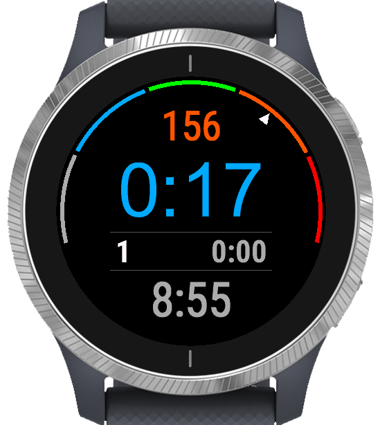
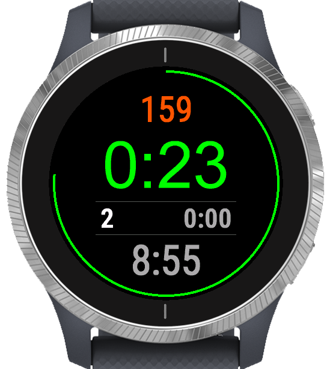
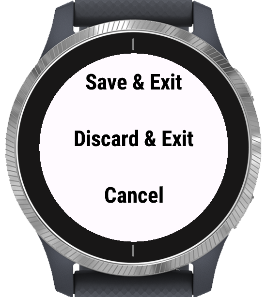

# Gym Intervals (Garmin Connect IQ / Venu)

A minimal Connect IQ app for Garmin Venu that records a gym session as a **Cardio** activity 
while helping with short, fixed rest periods between sets. It’s designed to require as little
interaction as possible during a workout, while still keeping the important info visible: 
current time, heart rate, lap/set timer, and total session duration.

## Why this exists

This app was built for machine-based gym training with short rests (typically ~30–40s), where
existing Garmin activities/timers require too much tapping and mode switching. The goal is a single 
screen and a single primary action: end a set → rest countdown → strong “rest is over” alarm → start the next set.

## What it records

- Starts recording immediately when you open it.
- Uses `ActivityRecording` and saves the workout as **Training → Cardio training** (shows up in
  Garmin Connect as a cardio workout, with timing and heart rate data).
- Adds a lap when you finish a working set (so sets are visible as laps).
- Keeps recording during rests and during the “rest finished” alarm (it never pauses automatically).

## On-screen UI

- **Working set:** lap timer + current heart rate, plus a heart-rate-zone gauge.
- **Resting:** remaining rest time with a countdown ring.
- **Always visible:** total session duration and the current clock time.

## Controls (Venu)

- **Lower button (Lap/Back):**
  - During a working set: ends the set and starts the rest countdown.
  - When the rest alarm is active: stops the alarm and starts the next set (new lap timer).
- **Upper button:** opens a finish menu (save/discard/cancel).

The UI also accepts touchscreen interaction; taps/swipes behave like the lap action to keep interaction simple.

## Rest alarm

When the rest countdown reaches zero, the watch vibrates in a repeating pattern until you tap the screen or 
press the lap button to begin the next set.

## Rest duration setting

- Configurable in app settings via Connect IQ.
- Default: **30 seconds**
- Minimum enforced by the app: **15 seconds**

Setting key: `restDuration` in `resources/properties.xml`.

## Build

This project currently targets the Garmin **Venu** because it’s the only device it has been developed and tested on. 
Other models may work, but they’re untested.

Prerequisites:
- Garmin Connect IQ SDK installed (`CIQ_SDK_HOME` set).
- A signing key (`developer_key.der`).

Generate a signing key:

```sh
openssl genrsa -out developer_key.pem 4096
openssl pkcs8 -topk8 -nocrypt -in developer_key.pem -out developer_key.der -outform DER
```

Build command:

```sh
monkeyc -f monkey.jungle -o bin/GymActivity.prg -y developer_key.der
```

## Install on a real watch (sideload)

1. Build `bin/GymActivity.prg`.
2. Connect the watch via USB.
3. Copy `bin/GymActivity.prg` to `GARMIN/APPS/` on the device.


## Screenshots (simulator)




